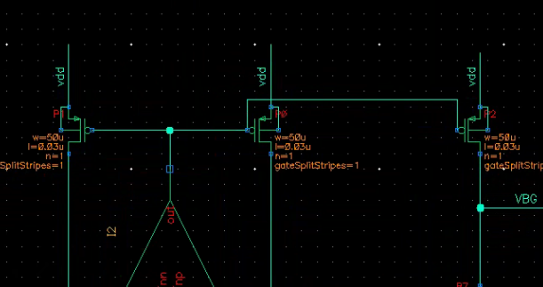
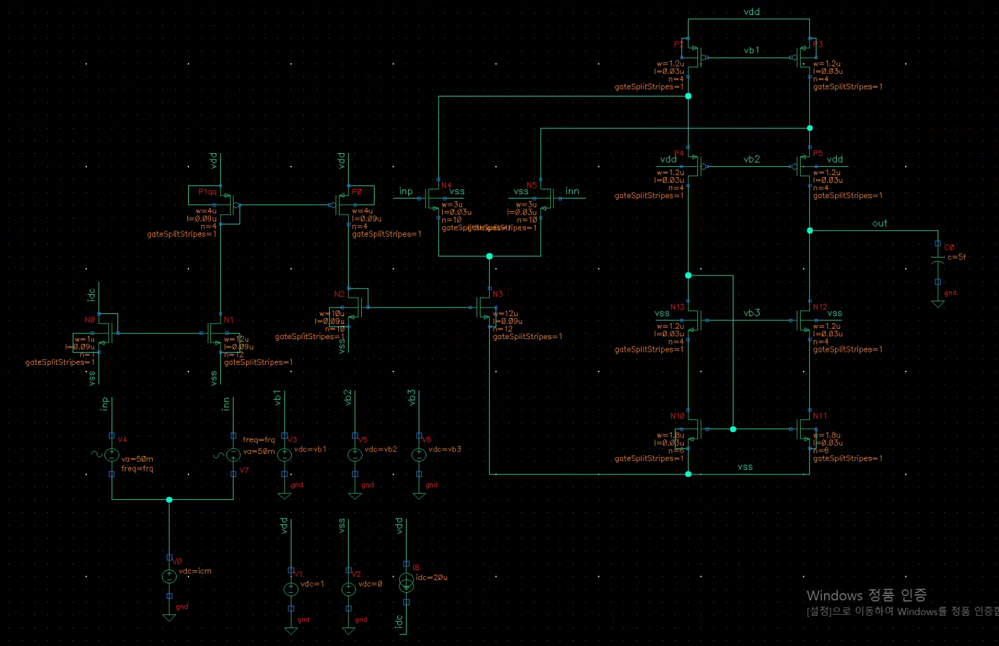
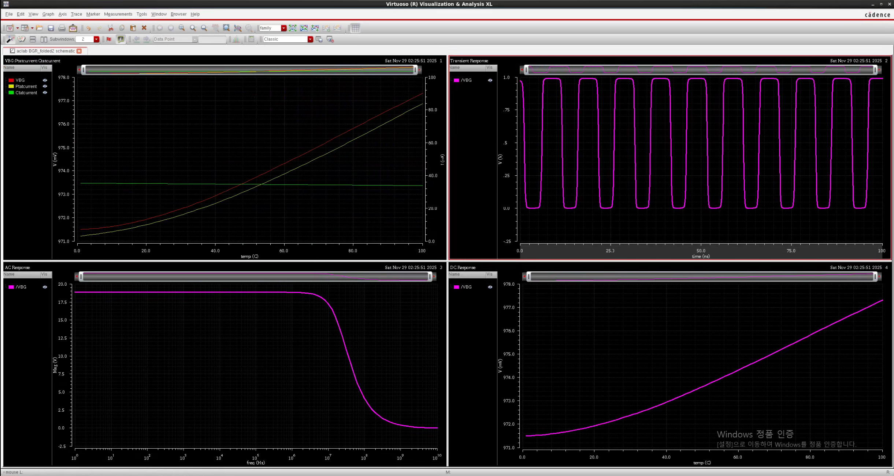
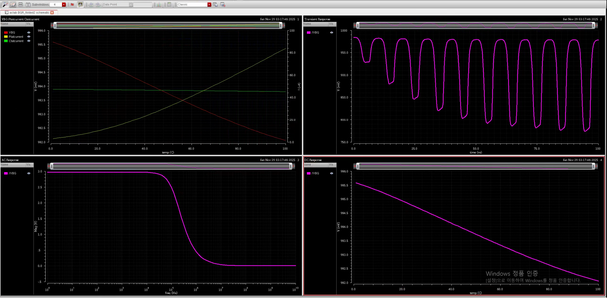
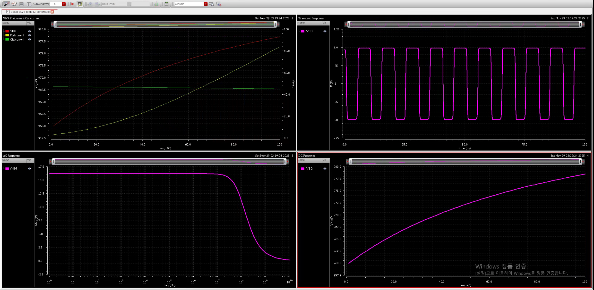
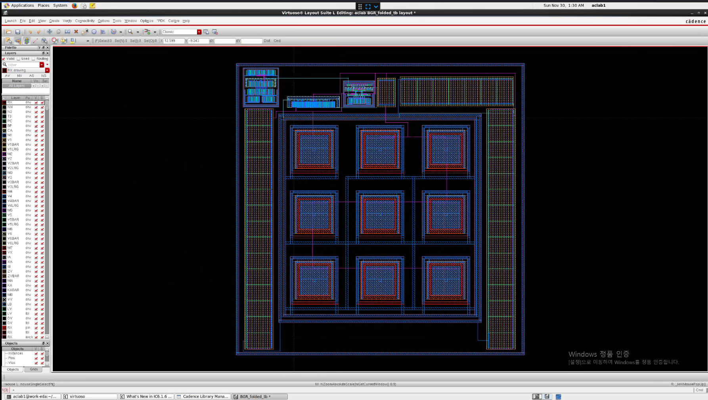

# Bandgap Reference 설계 실습 보고서

아날로그 집적회로 설계 Final Project 자료입니다. 1 V 저전압 환경에서 안정적인 기준 전압을 생성하는 Bandgap Reference(BGR)를 설계하고, 온도 및 공정 변화에 대한 안정성을 검증했습니다.

## 프로젝트 개요

- 설계 대상: 1 V 저전압 Bandgap Reference
- 핵심 구조: BJT 1:N 비율 기반 PTAT/CTAT 전류 합성
- 증폭기: Folded Cascode Op-Amp
- 목표 조건:
  - Op-Amp gain > 30 dB
  - Power < 2.5 mW
  - VBG variation < 7 mV
  - PMOS saturation을 위한 output common-mode 및 headroom 확보
- 검증 항목: Temperature sweep, process corner, DRC/LVS, PEX

## 핵심 설계 내용

### BJT 비율 선정

BGR의 PTAT 성분은 BJT 간 `V_BE` 차이에서 생성되며, BJT 면적 비율 `1:N`이 `Delta V_BE` 크기와 PTAT 전류 기울기를 결정합니다. 1:4, 1:8, 1:16 구조를 비교한 결과, PTAT 기울기와 CTAT 보상 균형, 전력, 레이아웃 대칭성을 고려해 최종적으로 `1:8` 비율을 선택했습니다.

### PMOS Headroom

상단 PMOS가 saturation 영역에서 동작해야 PTAT/CTAT 전류가 정확하게 형성됩니다. 초기에는 PMOS size를 크게 잡아 headroom을 확보했으나 power가 증가하는 문제가 있어, output common-mode와 전력 소모의 trade-off를 고려해 size를 조정했습니다.

### Folded Cascode Op-Amp

저전압 환경에서 충분한 gain과 출력 스윙을 확보하기 위해 Folded Cascode Op-Amp를 사용했습니다. 시뮬레이션 기준 DC gain은 약 38 dB, output common-mode는 약 380 mV로 확인되었으며, 이는 BGR 내부 PMOS의 saturation 조건을 만족시키기 위한 설계 방향과 맞습니다.

### Layout 및 검증

BJT array는 1:8 비율을 맞춰 대칭적으로 배치했고, matching이 중요한 저항 및 current mirror는 대칭 구조를 적용했습니다. Guard ring, dummy device, 규칙적인 routing을 통해 substrate noise와 mismatch를 줄였으며, DRC/LVS 검증을 통과했습니다.

## 주요 결과

| 항목 | 결과 | 비고 |
| --- | --- | --- |
| NN temperature sweep | VBG 약 0.971-0.978 V, variation 약 6 mV | 목표 variation 만족 |
| SS corner | VBG gap 약 3.53 mV, power 약 1.12 mW | 온도 보상이 가장 안정적 |
| FF corner | VBG gap 약 18.51 mV, power 약 2.71 mW | worst-case, 개선 필요 |
| Folded Cascode Op-Amp | gain 약 38 dB, OCM 약 380 mV | PMOS saturation 조건 고려 |
| Layout 검증 | DRC/LVS 통과 | schematic-layout 일치 확인 |

## 대표 이미지

### Final BGR Schematic



### Folded Cascode Op-Amp



### NN Simulation Result



### Process Corner Results

| SS corner | FF corner |
| --- | --- |
|  |  |

### Layout



## 자료 구성

```text
.
|-- README.md
|-- data/
|   |-- Bandgap Reference 설계 실습 보고서.docx
|   |-- Bandgap Reference 설계실습발표자료.pptx
|   `-- 아집적 대본.txt
`-- media/
    |-- BGR.PNG
    |-- FC.PNG
    |-- simresult.PNG
    |-- ssconorresult.PNG
    |-- ffconorresult.PNG
    `-- ...
```

원본 보고서와 발표 자료는 아래에서 확인할 수 있습니다.

- [보고서 원본 DOCX](<data/Bandgap Reference 설계 실습 보고서.docx>)
- [발표자료 PPTX](<data/Bandgap Reference 설계실습발표자료.pptx>)
- [발표 대본 TXT](<data/아집적 대본.txt>)

## 개선 방향

FF corner에서는 PTAT 성분과 전력 소모가 과도하게 증가해 목표 variation과 power를 초과했습니다. 추후 개선 방향은 PTAT 저항 증가, BJT 비율 재조정, Op-Amp bias 전류 보정, output pole 안정화를 위한 compensation 추가, 저항 온도계수 조정입니다.
